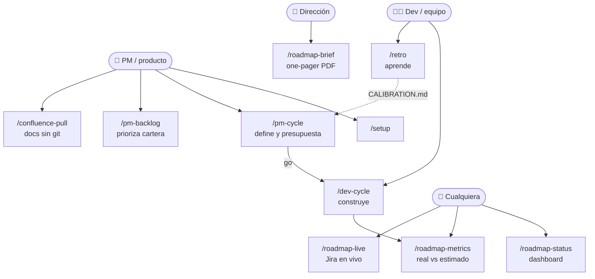
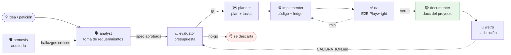
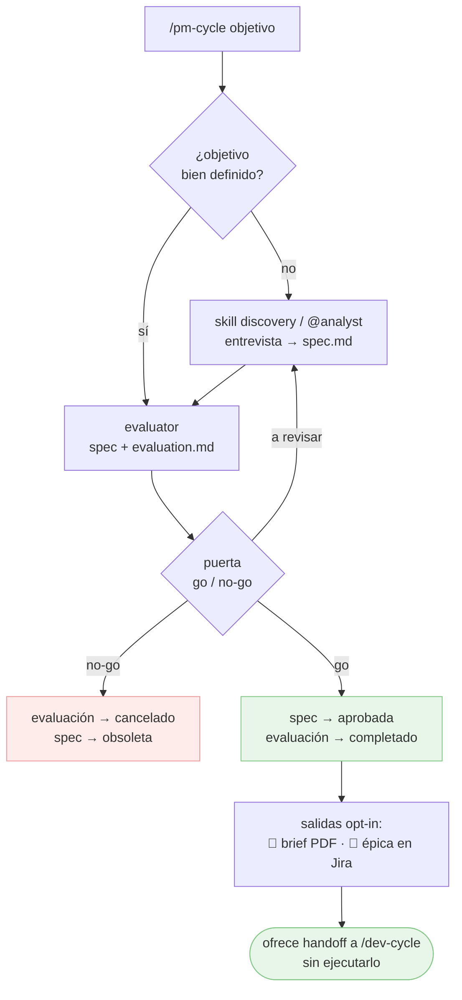
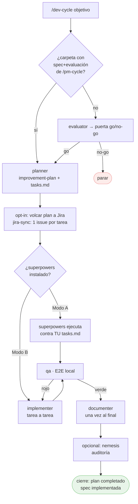
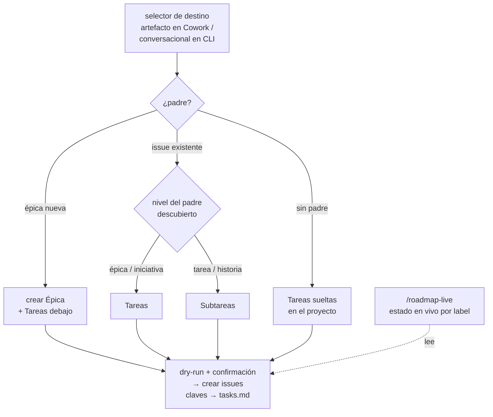
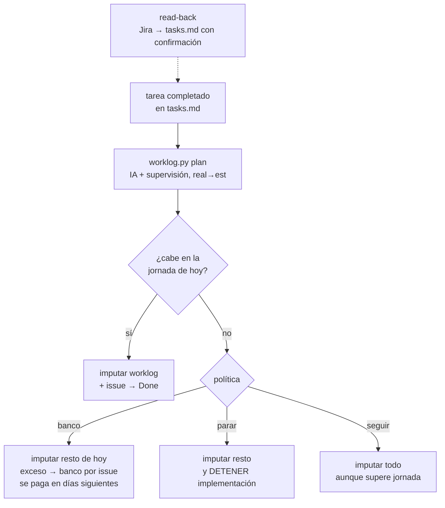
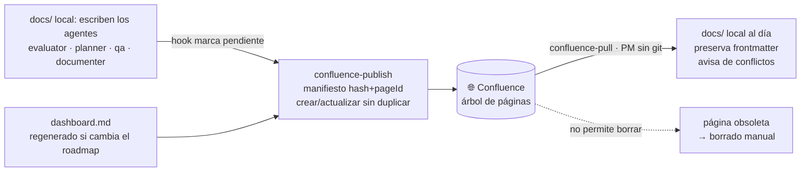
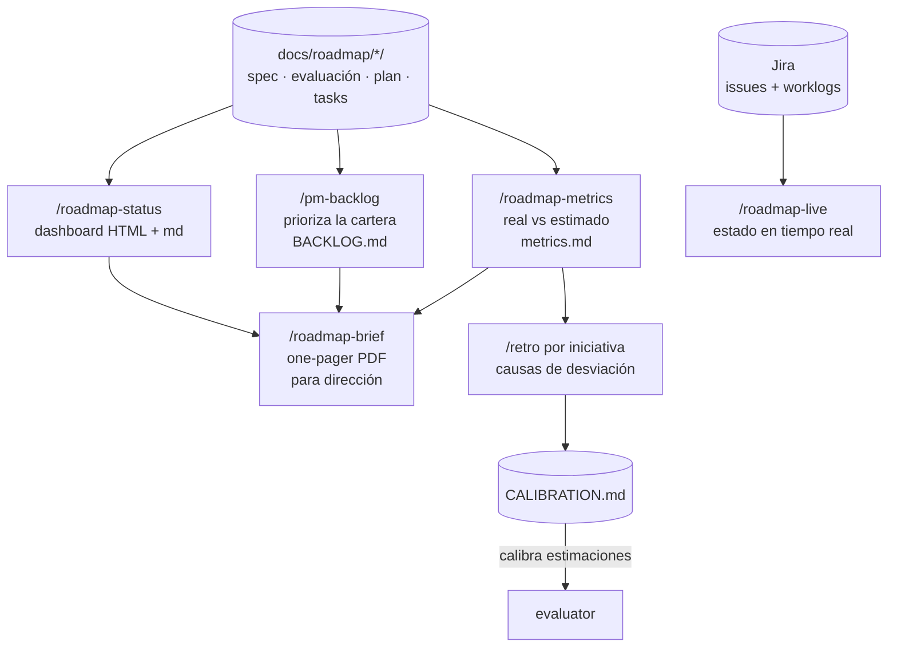
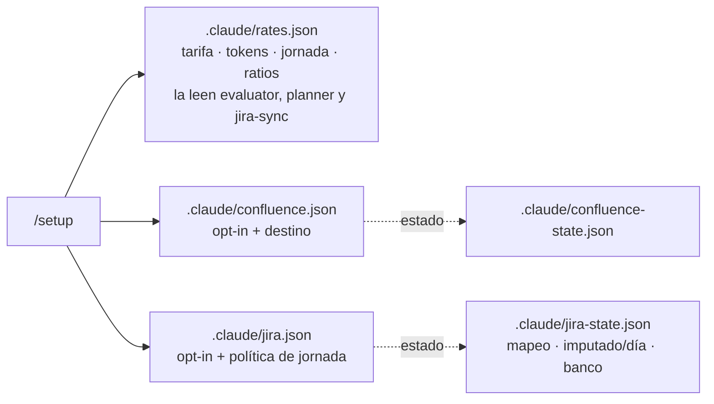

# Flujos del plugin — diagramas

Visión visual de cómo encajan agentes, comandos y skills. Los diagramas son Mermaid
(se renderizan en GitHub y editores compatibles).

**Leyenda:** flecha **continua** = flujo principal · flecha **punteada** = opcional, retorno o feedback · rombo = decisión/puerta · verde = camino de avance (*go*/verde) · rojo = rechazo o vuelta atrás (*no-go*/rojo).

## 0 · Mapa general — quién usa qué

## 1 · La cadena completa de una iniciativa

Fase de **producto**: `analyst → evaluator`. Fase de **desarrollo**: `planner → implementer → qa`.

Todo vive en **una carpeta por iniciativa**: `docs/roadmap/<fecha>-<slug>/`
(`spec.md → evaluation.md → improvement-plan.md + tasks.md → testing/ → retro.md`).

## 2 · `/pm-cycle` — rol producto (define y presupuesta, cierra en la puerta)

## 3 · `/dev-cycle` — ciclo de desarrollo (con puertas)

`tasks.md` es el **ledger canónico** de progreso en los dos modos.

## 4 · Jira (opt-in) — volcado del plan al crearlo

## 4b · Jira (opt-in) — imputación al completar cada tarea

## 5 · Confluence — bidireccional (opt-in)

## 6 · Visibilidad y aprendizaje (todo solo-lectura)

## 7 · Configuración (una pasada con `/setup`)

Detalle de cada fichero: regla 9 de [`CONVENTIONS.md`](CONVENTIONS.md). Comportamientos del
conector Atlassian: [`atlassian-connector-notes.md`](atlassian-connector-notes.md).

> **Nota (Confluence):** si esta página se publica en Confluence vía `confluence-publish`, los
> diagramas Mermaid solo se dibujan si el espacio tiene una app/macro de Mermaid instalada; si no,
> se verá el código fuente del diagrama. En GitHub y editores compatibles se renderizan siempre.

> **Mantenimiento:** al añadir o cambiar un agente, comando o skill, actualiza el diagrama
> correspondiente de este documento (ver checklist de `CONVENTIONS.md`).
